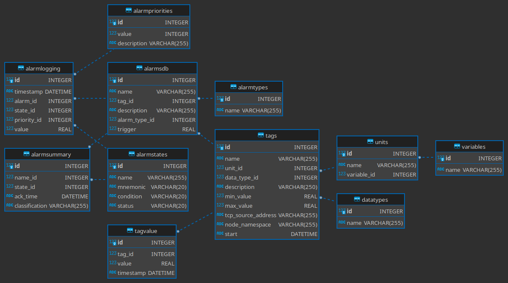

# Database Models

The entity relational diagram for PyHades database models is shown as follow:



PyHades has the following tables:

- Tags: It stores the information to define tags.
- TagValue: It stores the timeserie database for historian.
- DataTypes.
- Units.
- Variables.
- AlarmsDB: It stores the information to define alarms.
- AlarmLogging: Log all alarm triggered and when it changes of state.
- AlarmSummary: It stores the alarm life cycle.
- AlarmPriority.
- AlarmStates.
- AlarmTypes.

The *Units* and *Variables* schemas are based on process variables according [the International Society of Automation, ISA](https://www.isa.org/getmedia/192f7bda-c77c-480a-8925-1a39787ed098/CCST-Conversions-document.pdf) standard. Due to this there are some default variables and units.

Here, you can see, the default variables and units.

* Pressure
    * Pa, kPa, MPa, mmHg, psi, atm, bar, inH2O, inHg, cmHg, ftH2O, mH2O, kgf/cm2
* Temperature
    * ªC, ªF, K, R
* Time
    * ms, s, min, h, d
* MolarFlow
    * kmole/s, kmole/min, kmole/h
* MassFlow
    * kg/s, kg/min, kg/h, g/s, g/min, g/h, lb/h, tonne/h
* VolumetricFlow
    * lt/s, lt/min, lt/h, m3/s, m3/min, m3/h, ft3/s, ft3/min, ft3/h, US gal/min, US brl/d, Nm3/h, Std. ft3/h, Std. ft3/min
* MassDensity
    * kg/m3, g/ml, lb/ft3, lb/in3
* MolarDensity
    * kmole/m3
* Speed
    * m/s, km/h, m/min, ft/s, ft/min, mi/h
* Length
    * Em, Pm, Tm, Gm, Mm, km, hm, dam, m, dm, cm, mm, um, nm, pm, fm, am, in, ft, yd, mi
* Area
    * m2, cm2, mm2, km2, in2, ft2, yd2, mi2
* Volume
    * m3, lt, ml, in3, ft3, US gal, Imp gal, US brl
* Mass
    * Eg, Pg, Tg, Gg, Mg, kg, hg, dag, gecigrams, dg, cg, mg, ug, ng, pg, fg, ag, tonne, lb, oz
* DynamicViscosity
    * cp, poise, lb/(ft.s)
* KinematicViscosity
    * cs, St, ft2/s, m2/s
* Conductivity
    * BTU.in/(h.ft2.ªF), W/(m.K)
* Energy
    * J, N.m, erg, dyn.cm, kWh, cal, ft/lbf, BTU
* Power
    * W, J/s, cal/s, ft/(lbf.s), BTU/s, hp
* Acceleration
    * m/s2, in/s2, ft/s2, mi/s2

If you want to add new variables and units, you can do it defining a json file with the following structure

```json
{
    "VariableName": [
        ["unit_name", "unit_symbol"]
    ]
}
```

For example

```json
{
    "Temperature": [
        ["degree_celsius", "ºC"]
    ]
}
```

Once you define your json file, you can add it to your database using the CVTEngine instance:

```python
from pyhades.tags import CVTEngine

tag_engine = CVTEngine()
tag_engine.add_variables("url/variables.json")
```